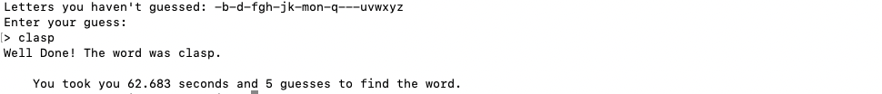

# Node.js Wordgame

A simple Node-based word game similar to Wordle that can be played in the terminal and works on Unix-like operating systems.

A dictionary of 5-letter words is generated based on the `words` file in `/usr/share/dict` on Unix-like machines. From this dictionary, a 5-letter answer word is selected at random.

### How To Play
Clone the repository and open directory with in terminal.

Run as follows:
```bash
node app.js
```

The following instructions will show in terminal:

 

You can then enter your first guess and click Enter, which will return a list of the letters you have not yet guessed and a key showing if you matched any letters in the answer.

 

You are allowed to keep guessing until you find the answer. Once you enter the correct answer, you will receive confirmation along with information about how long it took you to find the answer and how many guesses you entered:

 

If you enter an invalid answer, you will be asked to guess again. Valid answers must be 5-letters long and be present on the `words` file.

 


 